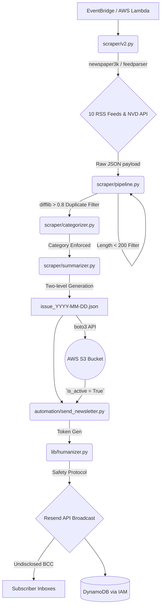

# ZeroDay Daily (bot0)
> **Version 4.1 — Definitive Technical Specification & Architecture**

ZeroDay Daily is a production-grade, serverless-native cybersecurity newsletter engine. The system scrapes real-time vulnerability data and threat feeds, processes them via a concurrent AI pipeline, uploads structured logs to cloud storage, and dispatches casual, human-like briefs to verified subscribers.

---

## 1. System Architecture Map

The execution lifecycle of ZeroDay Daily is sequential and fully automated. The ingestion, categorization, ranking, and notification flows are orchestrated as follows:



---

## 2. Directory Structure

The repository is modularly organized to separate logic, scraper engines, distribution systems, and test frameworks:

```
├── .env                         # Local environment configuration
├── run_tests.py                 # Central test suite runner
├── run_test_email.py            # Local newsletter generation & email dispatch test
├── requirements.txt             # Primary application dependencies
├── Dockerfile                   # Service containerization
├── DEPLOYMENT.md                # Deployment instructions
├── documentation.md             # Core technical reference guide
├── automation/                  # Automation scripts
│   ├── send_blog_alert.py       # Event-driven individual alert system
│   └── send_newsletter.py       # Main newsletter broadcast dispatch logic
├── lib/                         # Shared project utility libraries
│   ├── content.py               # S3 bucket reader & cache interface
│   ├── db.py                    # DynamoDB subscriber & log operations
│   ├── humanizer.py             # Casual tone rewriter with safety filters
│   ├── notifications.py         # Resend verification & broadcast wrappers
│   └── validation.py            # Email & phone number validation utilities
├── llm/                         # LLM integration client
│   ├── client.py                # Provider-routing LLM wrapper
│   └── deepseek_client.py       # DeepSeek chat model connector
├── scraper/                     # Ingestion & processing pipeline
│   ├── categorizer.py           # Feed classification module
│   ├── summarizer.py            # Dual-level AI generation models
│   ├── utils.py                 # Ranking & duplicate detection utils
│   ├── pipeline.py              # Processing & S3 orchestration
│   ├── v2.py                    # Ingest scheduler & raw crawler
│   └── test_pipeline.py         # Pipeline test script
└── tests/                       # Unit test suite
    ├── test_unit_content.py     # Content manager S3 mocks
    ├── test_unit_db.py          # DynamoDB client mocks
    ├── test_unit_humanizer.py   # Tone rewriter and filter tests
    ├── test_unit_pipeline.py    # Pipeline ranking & deduplication tests
    └── test_unit_validation.py  # Validator unit tests
```

---

## 3. Data Schemas & Database Structure

### 3.1 Cloud Storage Manifests (AWS S3)
Raw and finalized newsletters are written dynamically to AWS S3 (`S3_BUCKET_NAME`) via native **IAM Execution Roles**, bypassing the need to store static AWS credentials in memory.

#### Daily Issue Artifact (`issue_YYYY-MM-DD.json` & `latest.json`)
```json
{
  "date": "2026-06-26",
  "top_stories": [
    {
      "title": "Hackers exploit new vulnerability in standard router OS",
      "category": "Zero-Day",
      "short_summary": "Summary targeting 3-5 highly engaging sentences.",
      "deep_summary": "Detailed breakdown targeting 300 to 600 words with Intro -> Insight -> Takeaway structure.",
      "score": 18, 
      "source": "RSS Scraping",
      "url": "https://example.com/sec-news"
    }
  ],
  "cves": [
    {
      "title": "Vulnerability CVE-2026-1234",
      "summary": "AI generated breakdown of the CVE description.",
      "cve_ids": ["CVE-2026-1234"],
      "score": 10
    }
  ]
}
```

### 3.2 Database Table Schema (AWS DynamoDB)
User subscriptions and email logs are maintained under the table configured in `DYNAMODB_TABLE_NAME`. The schema adopts a single-table design using dynamic Partition and Sort Keys:

| Partition Key (PK) | Sort Key (SK) | Attributes | Description |
|---|---|---|---|
| `EMAIL#<user_email>` | `PROFILE` | `verified_email` (bool), `is_active` (bool), `created_at` (ISO8601) | Main user subscription record. |
| `EMAIL#<user_email>` | `LOG#<date>` | `track_token` (str), `status` (str), `sent_at` (ISO8601) | Email dispatch record (ensures idempotency). |

---

## 4. LLM Configuration & Safety Constraints

To control potential AI hallucinations from DeepSeek models, strict constraints are enforced on system instructions and payload formatting.

### 4.1 Categorization Limits (`scraper/categorizer.py`)
Incoming stories are strictly classified to ensure uniform UI routing.
* **Forced Vocabulary:** `CVE`, `Malware`, `Ransomware`, `Data Breach`, `Zero-Day`, `Security Tools`, `General Security`, `Artificial Intelligence`, `Computer Science`, `Tech News`.
* **Fallback Strategy:** If the model returns a value outside the forced vocabulary, it instantly defaults to `"General Security"`.
* **LLM Hyperparameters:** `temperature: 0.1`, `max_tokens: 15`.

### 4.2 Summarization Limits (`scraper/summarizer.py`)
Incoming text undergoes preprocessing (`compress_content`) to prevent context window overflow by extracting `[:-1500]` and `[-500:]` segments.
* **LLM Hyperparameters:** Model: `deepseek-chat`, `temperature: 0.5`, `max_tokens: 2000`, `base_delay: 6.0`.
* **Layout Structure:** Requests a thorough multi-paragraph output formatted exactly as:
  ```
  [SHORT SUMMARY]
  [DEEP SUMMARY]
  ```

### 4.3 Humanizer Safety Filter (`lib/humanizer.py`)
Converts email bodies into casual, developer-to-developer plain-text messages.
* **Tone Restrictions:** Format is strictly plain-text. No HTML, no lists, and no headers are allowed.
* **Forbidden Marketing Words:** `exciting`, `launch`, `introducing`, `features`, `update`.
* **Link Constraint:** Contains exactly one link pointing to the full daily web issue.
* **Fallback Mode:** If the generated output fails the validation checks (e.g. contains markdown, HTML, or forbidden words), the system discards the LLM response and falls back to a safe pre-compiled template:
  ```python
  f"hey {user_name},\n\njust wanted to drop over some notes on {context} that I found recently. it seemed relevant to what we were looking at.\n\nhere is the link to the full list: {BASE_URL}/daily\n\nlet me know if you catch anything interesting in there."
  ```

---

## 5. Resiliency, Rate-Limiting & Security

### 5.1 NVD API Ingestion (`scraper/v2.py`)
* **Headers & Bot Spoofing:** To prevent scraper blocks, requests inject random `USER_AGENT` strings mimicking standard operating systems (Windows, Mac, Linux).
* **NVD API Fallback:** NVD is heavily rate-limited. Ingestion requests utilize a `timeout=20` guardrail combined with a retry loop `for attempt in range(3):`. If an HTTP error is raised, the script waits `5 seconds` before attempting a reconnection.
* **Artificial Crawl Delays:** Injected delays between unique domains using `time.sleep(random.uniform(1, 3))` blend bot traffic patterns naturally.

### 5.2 Storage Exponential Backoff (`scraper/pipeline.py`)
All cloud writes utilize the `_retry_storage` wrapper implementing a geometric fallback:
$$\text{delay} = 2^{\text{attempt}} \text{ seconds}$$
This reduces S3 rate exhaustion hazards under load.

### 5.3 Mailing List Leak Protections
To protect subscriber privacy and prevent DKIM/SPF rejection drops:
1. **DKIM Check:** Outbound mail processes verify the Resend sender domain dynamically using `resend.Domains.list()`.
2. **Exposure Mitigation:** Broadcasts are dispatched using `BCC` targeting the subscriber list. The primary `TO` header is mapped to `"undisclosed-recipients@zerodaily.in"`.
3. **Execution Idempotency:** The dispatcher queries DynamoDB using the composite key `EMAIL#<email>` and `LOG#<date>` before executing `resend.Emails.send()` to prevent duplicate dispatches.

---

## 6. Environment Configurations (`.env`)

Configure the following variables in the `.env` file at the root directory:

| Environment Variable | Required | Description | Location Referenced |
|---|---|---|---|
| `DEEPSEEK_API_KEY` | **Yes** | Auth key for DeepSeek LLM processing engines. | `llm/deepseek_client.py` |
| `RESEND_API_KEY` | **Yes** | Auth key handling subscription verifications & newsletters. | `lib/notifications.py`, `automation/*` |
| `AWS_REGION` | No | Target AWS region (defaults to `us-east-1` or `ap-south-2`). | `lib/db.py`, `lib/content.py`, `scraper/*` |
| `S3_BUCKET_NAME` | No | Target S3 bucket for storing generated issues. | `lib/content.py`, `scraper/pipeline.py` |
| `DYNAMODB_TABLE_NAME`| No | Target DynamoDB table name (defaults to `ZeroDaily-DB`). | `lib/db.py` |
| `BASE_URL` | No | Root web address of the ZeroDay Daily portal. | `lib/notifications.py`, `lib/humanizer.py` |

---

## 7. Testing System Guide

The project includes both simulated pipeline integration scripts and a fully mocked unit test suite.

### 7.1 Mocked Unit Test Suite
The unit testing system leverages Python's built-in `unittest` framework to verify system components in isolation without triggering real API costs, S3 uploads, or email dispatches.

#### Running the Unit Tests
From the root directory, run:
```bash
python run_tests.py
```

The runner discovers all unit tests in the `tests/` directory matching `test_unit_*.py`:
* **`tests/test_unit_validation.py`**: Tests normal, disposable, and malformed email validation rules, and phone number formatting.
* **`tests/test_unit_humanizer.py`**: Tests casual tone humanization limits, safety filter keyword checks, HTML rejection rules, and fallback triggers.
* **`tests/test_unit_db.py`**: Mocks DynamoDB resources to test subscriber lists fetching, idempotency log checks, and status writing.
* **`tests/test_unit_content.py`**: Mocks AWS S3 client responses to test issue dates caching and daily archive retrieval.
* **`tests/test_unit_pipeline.py`**: Tests the core deduplication logic, rank sorting, and structured newsletter formatting with local mocks.

### 7.2 Standalone Integration Tests
If real credentials are configured in `.env`, you can execute these test scripts to verify live service integrations:
1. **Pipeline Execution Integration:**
   ```bash
   python scraper/test_pipeline.py
   ```
   *If a local `scraped_data.json` is missing from the output directory, the test automatically creates a mock parsed dataset, executes the AI summarization/categorization pipeline, uploads the artifacts to S3, and generates a preview of the newsletter text (`test_newsletter.txt`).*

2. **LLM Connection Integration:**
   ```bash
   python tests/test_integration_deepseek.py
   ```
   *Sends a sample cybersecurity article to the DeepSeek API to verify model authentication, rate-limiting, and paragraph response formats.*

3. **Tone Rewrite Integration:**
   ```bash
   python tests/test_integration_humanizer.py
   ```
   *Converts raw HTML snippets into casual plain text to inspect length constraints and safety filters.*

4. **Feed Fetcher Test:**
   ```bash
   python tests/test_integration_feeds.py
   ```
   *Tests connection status and entry parsing efficiency across primary target RSS links.*

5. **Email Dispatch Integration:**
   ```bash
   python tests/test_integration_send.py
   ```
   *Dispatches a test newsletter directly to a developer inbox to inspect layout structures, links styling, and SPF/DKIM validation.*
