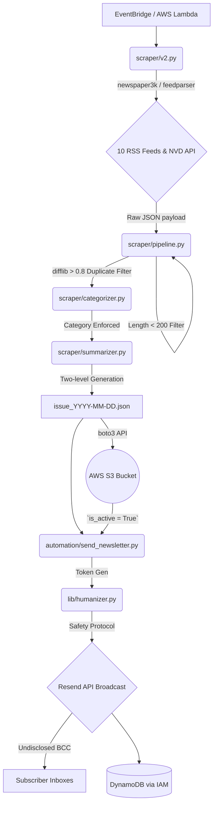

# ZeroDay Daily (bot0) Project Documentation
**Version 4.0 - Definitive & Pixel-Perfect Technical Specification**

This document provides absolute granularity on the ZeroDay Daily architecture. It maps out byte-for-byte structures, explicit execution constraints, system edge-cases, variable schemas bridging local instances with Azure cloud operations, exact LLM constraints, and end-to-end flowchart orchestration.

---

## 1. System Architecture Map

The entire execution lifecycle is strictly sequential and fully automated.



---

## 2. System Schemas & Data Structures

### 2.1 Cloud Blob Manifest (AWS S3)
The application relies dynamically on objects stored in AWS S3 (`S3_BUCKET_NAME`). Access is handled entirely via native **IAM Execution Roles**, meaning no literal API keys or access tokens are loaded in memory for storage tasks.

#### `issue_YYYY-MM-DD.json` & `latest.json`
The primary daily artifact generated by `scraper/pipeline.py`.
```json
{
  "date": "2026-04-18",
  "top_stories": [
    {
      "title": "Hackers exploit new vulnerability in standard router OS",
      "category": "Zero-Day",
      "short_summary": "Generated by DeepSeek targeting 3-5 readable sentences.",
      "deep_summary": "Generated by DeepSeek targeting 300 to 600 words with Intro -> Insight -> Takeaway structure.",
      "score": 18, 
      "source": "RSS Scraping",
      "url": "https://example.com/sec-news"
    }
  ],
  "cves": [
    {
      "title": "Vulnerability CVE-2026-1234",
      "summary": "AI generated breakdown of the CVE description.",
      "cve_ids": ["CVE-2026-1234", "CVE-2026-1235"],
      "score": 10
    }
  ]
}
```

#### `subscribers.json` & `subscribers_backup.json` (Deprecated)
Historically used for subscriber management, currently replaced entirely by serverless execution targeting `DynamoDB`.
```json
[
  {
    "email": "user@domain.com",
    "verified_email": true,
    "is_active": true,
    "verification_token": "abcd1234efgh5678",
    "verification_token_created_at": "2026-04-18T12:00:00Z",
    "unsubscribe_token": "jklm9012nopq3456",
    "created_at": "2026-04-17T08:30:00Z"
  }
]
```

---

### 2.2 Local Database Constraints (AWS DynamoDB)
State is maintained via a NoSQL AWS DynamoDB table targeting the `DYNAMODB_TABLE_NAME` config. Access is governed via implicit IAM Execution Roles.

| Entity Type    | Partition Key (PK) | Sort Key (SK)     | Attributes                         |
|----------------|--------------------|-------------------|------------------------------------|
| **Subscriber** | `EMAIL#<email>`    | `PROFILE`         | `verified_email`, `is_active`, etc |
| **EmailLog**   | `EMAIL#<email>`    | `LOG#<date>`      | `track_token`, `status: 'sent'`    |

---

## 3. Explicit LLM System Constraints & Prompts

To tightly control AI hallucination from the DeepSeek models, strict logic formats are injected directly into `messages` arrays at `llm/client.py`.

### 3.1 Summarization Limits (`scraper/summarizer.py`)
Articles undergo a pre-processing step `compress_content(content)` cutting the context window (pulls `[:-1500]` and `[-500:]`) to prevent context-overflow before invoking **Model: deepseek-chat** 

**Deep Summary Prompt**:
> "You are an expert cybersecurity analyst writing for a newsletter... Break any detailed content into small readable paragraphs (2-4 lines max) to avoid long dense blocks of text. Write a thorough, multi-paragraph breakdown with a target length of 300 to 600 words. Format your response EXACTLY as follows: 
[SHORT SUMMARY] 
[DEEP SUMMARY]"

**System Frame Constraints**: `temperature: 0.5`, `max_tokens: 2000`, `base_delay: 6.0`.

### 3.2 Categorization Limits (`scraper/categorizer.py`)
Articles are tightly classified to ensure UI uniformity across the frontend web application.

**System Prompt (Forced Vocabulary):**
> "You must choose EXACTLY ONE category from the list below: CVE, Malware, Ransomware, Data Breach, Zero-Day, Security Tools, General Security, Artificial Intelligence, Computer Science, Tech News. Return ONLY the category name. Do not output anything else."

If the LLM output does not exact-match a substring inside Python, it instantly defaults to `"General Security"`. Constraints: `temperature: 0.1`, `max_tokens: 15`.

---

## 4. API Throttling & Network Edge Cases

### 4.1 Internet Ingestion (`scraper/v2.py`)
- **Headers & Bot Protection:** Injects randomized `USER_AGENTS` strings covering Windows/Mac/Linux to prevent simple User-Agent WAF filtering during `newspaper3k` web DOM downloads.
- **NVD API Fallback:** NIST strictly rate limits incoming hits. Code requests are throttled at `timeout=20`. Implements a manual `for attempt in range(3):` loop catching `requests.exceptions.HTTPError`. It forces a `time.sleep(5)` penalty upon failure before attempting re-connection.
- **Artificial Delay:** Standard `time.sleep(random.uniform(1, 3))` applies between unique domain reads to blend bot signatures naturally.

### 4.2 Storage Fallback (`scraper/pipeline.py`)
Any attempt pushing final execution states to AWS S3 utilizes an isolated wrapper: `_retry_storage()`.
- **Mathematical Delay**: Executes a strict geometric fallback `delay = 2 ** attempt`. (Attempt 1: 2s; Attempt 2: 4s; Attempt 3: 8s).

---

## 5. Automation Orchestration (`automation/send_newsletter.py`)

### 5.1 Security Abstractions & Verification
Outbound marketing mail is never generated raw. Before Resend API triggering:
1. Validates standard domain via `resend.Domains.list()` checking for `verified` constraints dynamically to avoid DKIM/SPF rejection drops.
2. Extracts payload logic directly utilizing an internal instance of `lib.content.get_latest_issue()`, bypassing recursive S3 requests using internal memory exclusively.
3. Sends `resend.Emails.send()` utilizing `BCC` natively mapped to `"undisclosed-recipients@zerodaily.news"` mitigating entire mailing list leak exposures.

### 5.2 Bot Analytical Email Dispatch
The very last step of the bot is self-reporting its hardware status. An email is dispatched automatically to admin administrators with a raw HTML block tracking internal Python benchmarks:
```html
<table border="1" cellpadding="8" style="border-collapse: collapse;">
    <tr><th>Metric</th><th>Value</th></tr>
    <tr><td>Total Execution Time</td><td>{total_time}</td></tr>
    <tr><td>Scraping Time</td><td>{scrape_time}</td></tr>
    <tr><td>AI Pipeline Time</td><td>{pipeline_time}</td></tr>
    <tr><td>Email Dispatch Time</td><td>{email_time}</td></tr>
</table>
```

---

## 6. Deployment Limits & Environment Config

### `runbot.sh` Hardware Bounds
When instantiated globally, Docker restricts potential LLM-pipeline memory runaways using native commands:
```bash
docker run -d \
   --cpus="1.0" \
   --memory="2048m" \
   -v $(pwd)/data:/app/data \
   zeroday_bot
```
The localized `data/` branch is volumed `-v` to the exact physical disc preserving SQLite boundaries during pipeline wipe events.

### Global Config Layout (`.env`)
| Variable                        | Purpose                                                                                   | Location Referenced                        |
|---------------------------------|-------------------------------------------------------------------------------------------|--------------------------------------------|
| `DEEPSEEK_API_KEY`              | Core authorization token for LLM parsing engines.              | `llm/deepseek_client.py`                   |
| `RESEND_API_KEY`                | Auth token string (`re_...`) handling transactional emails and newsletters.                   | `lib/notifications.py`, `automation/*`     |
| `AZURE_STORAGE_CONNECTION_STRING`| Absolute protocol connection key string for BlobServiceClient auth over HTTPS.            | `scraper/pipeline.py`, `lib/blob_store.py` |
| `AZURE_CONTAINER_NAME`          | Dynamic routing for blob injection (fallback is generically `"news"`).                    | `scraper/pipeline.py`, `lib/blob_store.py` |

_END OF DEFINITIVE SPECIFICATION._
